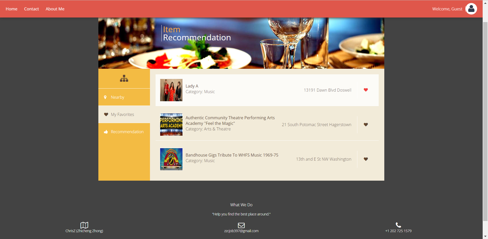

# Overview Event Recommendation - AWS based Web Service for Event Recommendation
## Event Recommendation based on geolocation

•	Developed interactive web pages for users to search and apply positions (HTML, CSS, JavaScript, AJAX).

•	Created three Java servlets with RESTful APIs to handle HTTP requests and responses.

•	Built MySQL database on Amazon RDS to store position data from TicketMaster Search API.

•	Used TicketMaster API to extract keywords from details of events.

•	Designed content-based recommendation algorithm to implement events recommendation.

•	Deployed to Amazon EC2 for scalability.

[#Demo](#Demo)

[#Features](#Features)

[#Applications](#Applications)

[#Dependencies](#Dependencies)

[#Contect](#Contect)

# Project Demo:
## Project Link: http://18.204.216.43:8080/Jupiter/#

# Features:
Front-end: Html/CSS/JS

Back-end: Java Spring MVC, MySQL(MAMP)

Search event: TicketMaster APIs

Recommendation: A content-based algorithm implemented in Java based on favorite categories.

Deploy: AWS EC2

# Applications: 
•	Eclipse

•	Postman

•	TicketMaster

•	MySQL

# Dependencies: 

<h2>Spring - Java</h2>

Created three Java servlets with RESTful APIs to handle HTTP requests and responses.

dependencies:

<ul>
  <li>mysql-connector-java-8.0.16.jar</li>
  <li>java-json.jar</li>
</ul>  

# Contect 
Email :  zzcjob397@gmail.com
